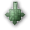
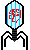
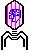
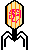
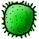
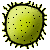
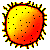

# Vírus - A Praga
    - Ivo Machado (21553684)
    - Joseph Levinthal (21553691)
    - Juliana Castro (21553685)
    - Oscar Othon (21551563)
    - Renato Lousan (21553693)
    - Ruan Barros (21553690)
    

`Vírus - A Praga` é um pequeno jogo desenvolvido em Java utilizando a API Visual `SWING`, tal API simplifica a camada de abstração de uma framework muito mais baixo nível baseada em OpenGL. 

## O Jogo 

Nosso projeto consiste em um jogo de plataforma com o objetivo de derrotar o maior número possível de vírus, enquanto tenta se defender dos mesmos.

Alguns Elementos importantes do jogo:

 - Nível de infecção (Saúde)
 - Pontuação
 - Soro de Fusão
 - Minas
 - Vírus
 - Torres

## Desenvolvimento 
O jogo foi desenvolvido em vários módulos separados com o objetivo de isolar cada controlador de cada componente.

* Controlador de Vírus (CTRVirus)

    Responsável por controlar as interações de um conjunto de vírus com o ambiente, sendo detectando colisões ou interações com minas terrestres. Também é responsável pelo "polling" de projéteis que são verificados.

* Controlador de Projéteis (CTRBullet)
    
    Responsável por controlar as interações de um conjunto de projéteis com o ambiente, movimentando-nos.

* Controlador de Ambiente (CTRDesktop)

    Responsável por controlar o ambiente em que o jogo está rodando, verifica a resolução da tela e sugere modificações.

* Controlador de Áudio (CTRAudio)

    Responsável por gerenciar um pool de clips de áudio para não afogar o controlador de áudio do computador.

* Controlador de Inicio (CTRKoulikov)
    
    Responsável por gerenciar a inicialização do ambiente gráfico.

### Implementação 

* Colisões

    Implementadas com o algoritmo padrão do Swing, utiliza a técnica de verificação de `Overflow or Intersect`.

    ```java
    public boolean intersects(Rectangle r) {
            int tw = this.width;
            int th = this.height;
            int rw = r.width;
            int rh = r.height;
            if (rw <= 0 || rh <= 0 || tw <= 0 || th <= 0) {
                return false;
            }
            int tx = this.x;
            int ty = this.y;
            int rx = r.x;
            int ry = r.y;
            rw += rx;
            rh += ry;
            tw += tx;
            th += ty;
            //      overflow || intersect
            return ((rw < rx || rw > tx) &&
                    (rh < ry || rh > ty) &&
                    (tw < tx || tw > rx) &&
                    (th < ty || th > ry));
        }
    ```

    ```java
    for (Bullet bull : bullets) {
                        Rectangle bulletCordinate = bull.getBounds();
                        Rectangle thisCordinate = virus.getBounds();
                        if (bulletCordinate.intersects(thisCordinate)) {
                            bull.setVisible(false);
                            bull.setLocation(-10, -10);
                            virus.hp -= bull.damage;

                            if (virus.hp <= 0) {
                                virus.die();
                                dGameWindow.virusAtuales--;
                            } else {
                                shiftBlood().setLocation(virus.getLocation());
                            }

                            try {
                                wnd.jPBInfection.setValue(wnd.jPBInfection.getValue() - 1);
                            } catch (Exception ex) {
                            }
                        }
                    }
    ```

    Basicamente, para cada projétil, é verificado se o mesmo se intercepta com o vírus atual, é uma verificação `O(n²)`. 

* Rotações

    Implementadas com base na função de transformação `rotate` do próprio canvas. 

    ```java
       @Override
    public void paintComponent(Graphics g) {
        Graphics2D g2d = (Graphics2D) g;
        g2d.rotate(Math.toRadians(rotation), this.getSize().width / 2, this.getSize().height / 2);
        super.paintComponent(g);
    }```

    Por um lado, uma função busca rotacionar o canvas da Turret com base no atributo `rotation`, que é modificado pela função que calcula o ângulo da turret em relação ao mouse.

    ```java
     @Override
            public void actionPerformed(ActionEvent e) {
                float centerX = getX() + getWidth() / 2;
                float centerY = getY() + getHeight() / 2;
                float radiansToMouse = (float) Math.atan2(centerX - MouseInfo.getPointerInfo().getLocation().getX(), centerY - MouseInfo.getPointerInfo().getLocation().getY());
                float degreesToMouse = (57.2957795f * radiansToMouse) * -1;
                rotation = degreesToMouse;
                repaint();
    ```

* Translações

Basicamente as translações são executadas por meio de transformações chamadas pela função `setLocation` do 
próprio canvas.

```java
virus.setLocation(virus.getLocation().x, virus.getLocation().y + new Random().nextInt(2) + 1);
```
   
* Cálculo de Trajetória

Para a trajetória foi recuperado o ângulo entre as posições do mouse para identificar quantos X variam em relação ao Y.

 ```java
   for (Bullet bullet : bulletList) {
                if (bullet.isActivated) {
                    if (bullet.getLocation().y < -9) {
                        bullet.isActivated = false;
                        bullet.setVisible(false);
                        bullet = null;
                    } else {
                        int inerithCx = bullet.inerithX * bulletControl.getDelay() / bullet.inerithY;
                        bullet.setLocation(bullet.getLocation().x - inerithCx, bullet.getLocation().y - bulletControl.getDelay());
                    }
                }
            }
```

### Características Interessantes

Os controladores gerenciam as classes `bean`, que representam abstrações em uma linguagem de alto nível do conceito dos objetos representados.

 * TrapMine 

    Representa uma mina terrestre que explode em contato com um vírus. Tambem possui localização relativa ao ambiente.

 * Turret   

    Representa a última esperança para o corpo invadido : a torre. A torre é responsável por abstrair a movimentação das armas e direcionar os projéteis.

 * Bullet   

    Representa os projéteis do jogo, os projéteis possuem tipo de carga, tal tipo aumenta ou diminui o equivalente a uma munição.

 * Virus    

    Representam propriamente os vírus do jogo, cada elemento individual tem uma posição relativa ao canvas no qual é desenhado e possui uma carga viral correspondente ao tipo de mutação, determinando sua forma.

    Existem seis tipos de vírus:

     *  - Normal

     *  - Mutado

     *  - Mutado Fortificado

     *  - Encapsulado

     *  - Encapsulado Malignp

     *  - Encapsulado Incandescente